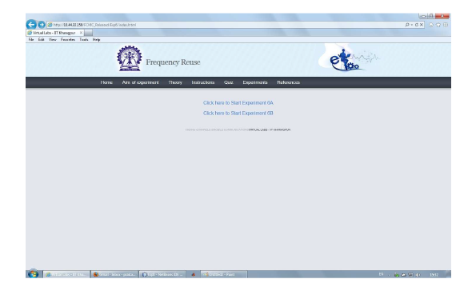
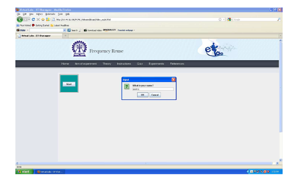
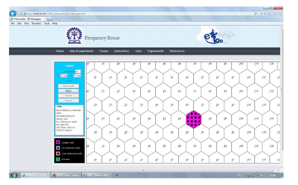
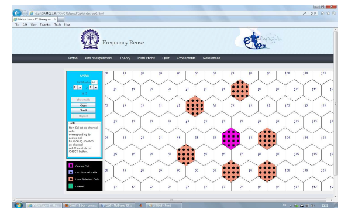
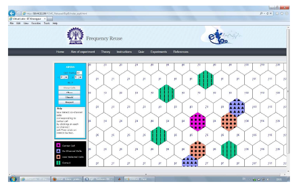
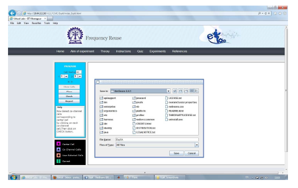

## Procedure

Follow the instructions given below to perform the experiments:-

## 1.1 Starting the Experiments :-

* Step 1: Click on the experiment you want to do by clicking on either 'Click here to start Experiment 6A (Co-channel cell)' or 'Click here to start Experiment 6B (Cell cluster)'.

      
      

## 1.2 Performing Experiment 6A :-

* Step 2: Let Experiment 6A (Co-channel cell) is chosen. Click on the button START. A page appears with a dialogue box asking for your name. Enter your name and click OK.

   

      
      

* Step 3: Choose the value of Cell Radius, i and j.

* Step 4: Click on the button Show Cells. For the given parameters, the value of Cluster-size N is shown in the LHS of the page and the generated cells are shown on the RHS of the page.

   

      
      

* Step 5: Within the generated cells the center cell is shown in pink colour. Select the Co-channel cells in orange colour for the center cell by finding the Co-channel cells from the formula given in the theory section.

   

      
      

* Step 6: Click on the button CHECK to see whether your manually selected Co-channel cells match with the correct Co-channel cells. If your manually selected cells do not match with the correct Co-channel cells then the correct Co-channel cells are displayed in sky blue colour. If your manually selected Co-channel cells match with the correct Co-channel cells then the correct Co-channel cells are over-marked in green colour.

    

      
      

* Step 7: Click on the button REPORT to generate the report of the experiment you have performed.

   

      
      

* Step 8: A dialogue box appears. Click on the button Save to save your report.

* Step 9: A dialogue box appears with the message that 'Your report has generated successfully'. Click on button OK in the dialogue box.

   

      
      

* Step 10: Now you can view the pdf report.

* Step 11: You can repeat the experiment by clicking the CLEAR button at the upper corner in the LHS of the page.
  
    
